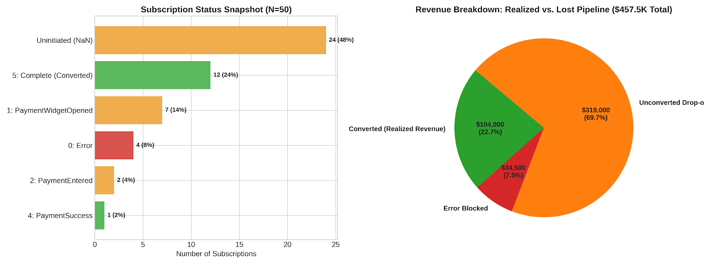
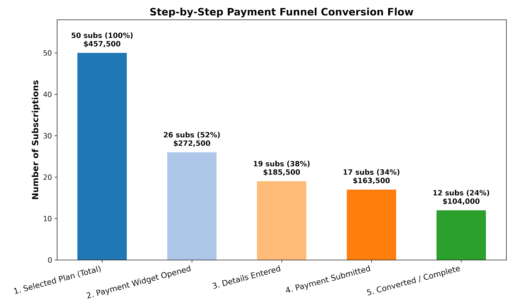

# Payment Funnel Analysis: SaaS Fintech & Conversion Optimization

## Table of Contents

- [Executive Summary](#executive-summary)
- [Business Problem](#business-problem)
- [Methodology](#methodology)
- [Skills & Technologies Demonstrated](#skills--technologies-demonstrated)
- [Results & Key Findings](#results--key-findings)
- [Business & Product Recommendations](#business--product-recommendations)
- [Next Steps](#next-steps)

---

## Executive Summary

This project analyzes payment funnel dynamics and checkout friction for enterprise B2B SaaS subscriptions. By evaluating payment status logs (`payment_status_log`) and customer subscription records, the analysis found that only **24.0%** of subscriptions successfully convert to paid status, leaving **$353,500 (77.3% of total pipeline revenue)** uncollected.

Key friction points:

- **Uninitiated checkout workflows:** 48.0% drop-off
- **Payment widget abandonment:** 14.0% drop-off
- **Payment processing errors:** 8.0% stuck directly in error

Strategic recommendations center on front-end checkout UI improvements, automated dunning/retry workflows, and asynchronous webhook error reconciliation.

---

## Business Problem

The finance and revenue operations teams reported a high volume of unpaid customer subscriptions. While customers regularly select paid subscription tiers, a large proportion fail to complete the payment journey. Because a user is created upon plan selection but only "converted" upon payment confirmation, the company suffers from a depressed conversion rate and substantial revenue loss.

**Core objectives:**

1. Map customer movement through the payment status funnel.
2. Identify major friction points, user errors, and third-party vendor drop-offs.
3. Formulate actionable product and engineering recommendations to maximize payment completion.

---

## Methodology

1. **Data Ingestion & Event Mapping:** Consolidated user transaction logs across `Payment_Status_Log.csv`, `Subscriptions.csv`, and `Payment_Status_Definitions.csv`.
2. **Funnel State Definitions:** Mapped 6 distinct workflow states:

   | ID | State |
   |----|-------|
   | 0 | Error |
   | 1 | PaymentWidgetOpened |
   | 2 | PaymentEntered |
   | 3 | PaymentSubmitted |
   | 4 | PaymentSuccess |
   | 5 | Complete |

3. **Cohort & Conversion Analysis:** Categorized subscription conversion performance and calculated total lost ARR/revenue per funnel stage.
4. **Log State Analysis:** Evaluated non-linear event journeys, identifying retry attempts, loopbacks, and state stuckness in `payment_status_log`.

---

## Skills & Technologies Demonstrated

- **Data Modeling & Analytics:** Funnel analysis, conversion rate optimization (CRO), cohort tracking, revenue loss estimation
- **Python Data Science:** `pandas` (event sequence manipulation, date handling, aggregation)
- **Product Analytics:** User event logging, friction point identification, drop-off taxonomy
- **SQL & Engineering Strategies:** Event logging schema design, webhook handling, error taxonomy, automated retry workflows

---

## Results & Key Findings

### 1. Payment Conversion Funnel Snapshot

Based on `Subscriptions.csv` (N = 50 total subscriptions, total potential revenue: **$457,500.00**):

| Funnel Stage / Current Status | Status ID | Subscription Count | % of Total | Potential Revenue | Revenue Status |
|-------------------------------|:---------:|-------------------:|-----------:|------------------:|----------------|
| Complete (Converted) | 5 | 12 | 24.0% | $104,000.00 | Realized |
| Uninitiated / Pending | NaN | 24 | 48.0% | $185,000.00 | Lost / Stuck |
| Payment Widget Opened | 1 | 7 | 14.0% | $87,000.00 | Lost / Stuck |
| Payment Entered | 2 | 2 | 4.0% | $22,000.00 | Lost / Stuck |
| Payment Submitted / Success | 4 | 1 | 2.0% | $25,000.00 | Pending Complete |
| Payment Error | 0 | 4 | 8.0% | $34,500.00 | Blocked by Error |
| **Total** | — | **50** | **100.0%** | **$457,500.00** | **$353,500 Unconverted** |

### 2. Visualizations

**Subscription status snapshot and revenue breakdown**

**Step-by-step payment funnel conversion flow**

### 3. Major Friction Points Identified

- **Uninitiated checkout drop-off (48% of subscriptions):** Nearly half of users select a paid tier but never open the payment portal (`Status_ID = NaN`). This indicates a lack of immediate redirect after plan selection or missing checkout calls-to-action (CTAs).
- **Widget abandonment (14% drop-off):** Customers open the modal (Status 1) but exit before entering payment details. Friction triggers include unexpected tax/fee additions or mandatory billing address fields.
- **Transaction error sticking (8% drop-off):** Users encountering validation or processing errors are not prompted effectively to update payment details, leading to complete abandonment.

---

## Business & Product Recommendations

1. **Immediate Modal Redirection:** Automatically open the payment portal right after a customer clicks "Select Plan" to resolve the 48% uninitiated drop-off.
2. **Inline Front-End Validation:** Add real-time field validation for card numbers, expiration dates, and CVV to catch user errors prior to gateway submission (Status 2 → Status 3).
3. **Automated Dunning & Recovery Emails:** Trigger automated email sequences when a user abandons at Status 1 or hits Status 0, providing a single-click direct link to complete payment.
4. **Webhook Synchronization Fixes:** Ensure third-party payment gateway success events (Status 4) asynchronously trigger final system provisioning (Status 5) so transactions don't get stuck right at completion.

---

## Next Steps

- [ ] **A/B test checkout UX:** Test a 1-step streamlined payment modal against the current multi-step entry form.
- [ ] **Implement granular error logging:** Expand Status 0 definitions in `payment_status_log` to store exact gateway response codes (e.g., `INSUFFICIENT_FUNDS`, `EXPIRED_CARD`, `GATEWAY_TIMEOUT`).
- [ ] **Set up real-time monitoring:** Build a Looker/Tableau alert dashboard notifying engineering whenever vendor payment error rates exceed 5% in a 1-hour rolling window.
